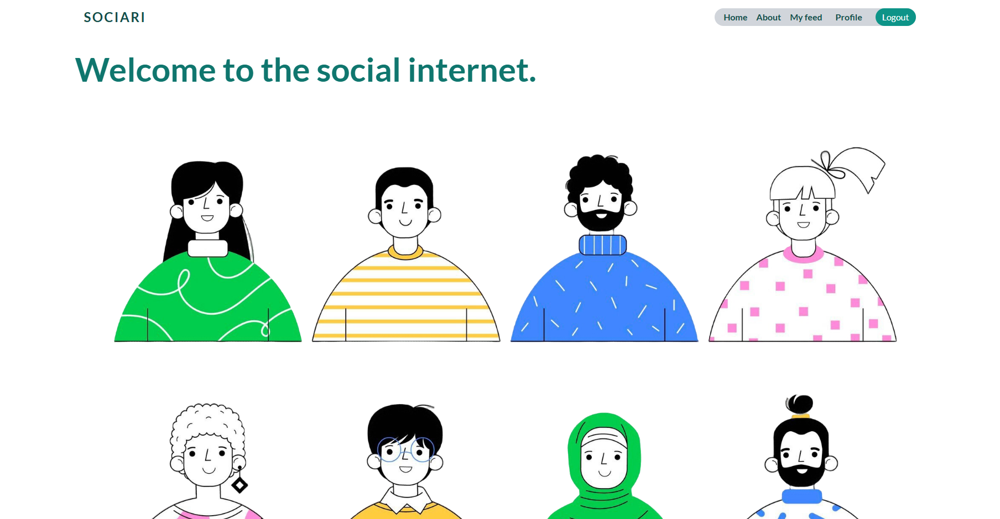
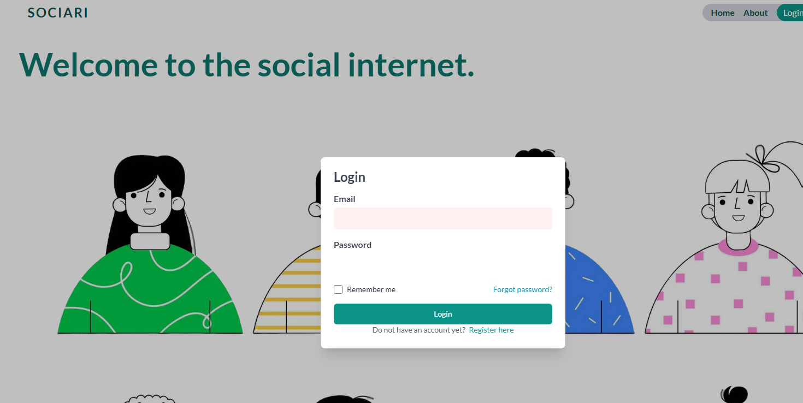
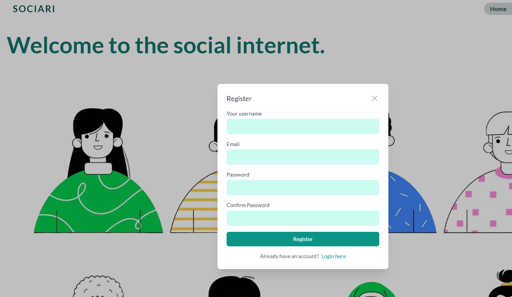
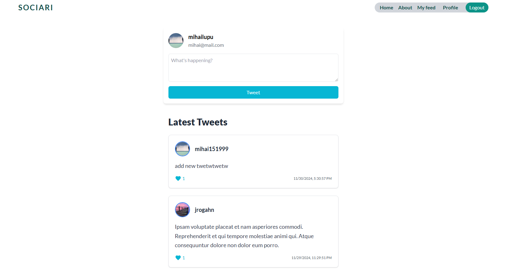
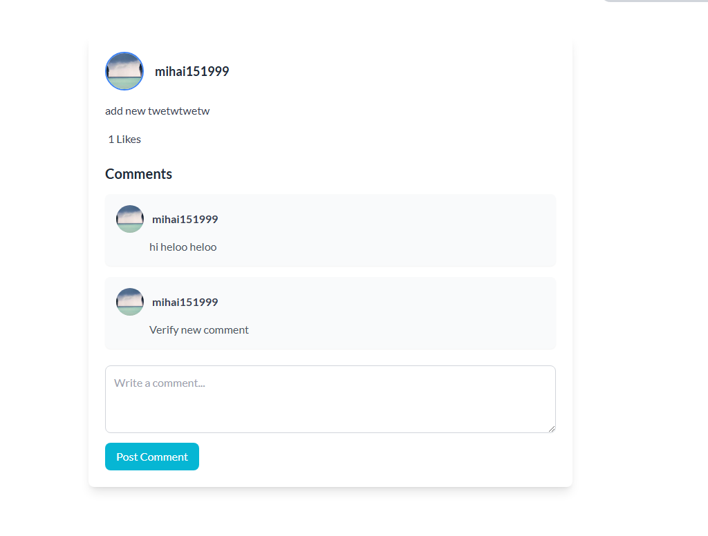
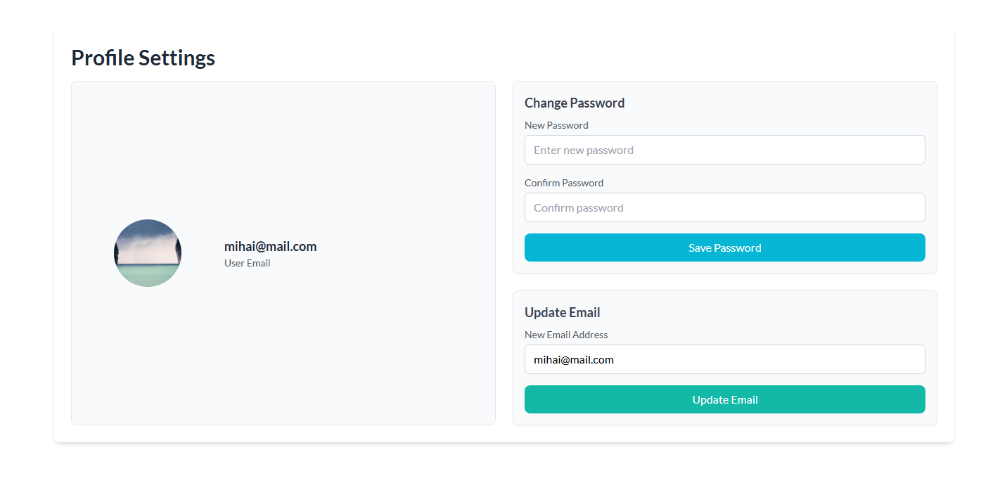

# Lucrare Individuala Framework

## Acest lucru individual reprezinta o încercare de a crea o clona a twitter folosind laravel drept backend si vue drept front end.

### Instrucțiuni privind instalarea și pornirea proiectului. Specificați dependențele necesare și pașii esențiali pentru a rula aplicația.

Pentru a rula proiectul într-un environment local trebuie sa ne asiguram ca avem php instalat si anume o versiune 8.3+, si mysql drept database server.

Dupa ce am clonat proiectul de pe github este necesar sa setam variabilele de mediu si sa rulam migratiile.

Si intr-un final, instalam dependentele prin

```
composer install
```

```
npm install
```

### Descriere aplicatie

Aceasta este o aplicatie clona asemanatoare twitter.

Prezinta functi de autentificare(creare cont si logare)



Abilitate de a crea tweeturi pe un feed, dar si de a vizualiza tweetul care reprezinta o ruta protejata.
Fiecare tweet prin urmare are o sectiune unde poti scrie comentarii.



La fel in panoul utilizatorului putem reseta parola si schimba emailul.

